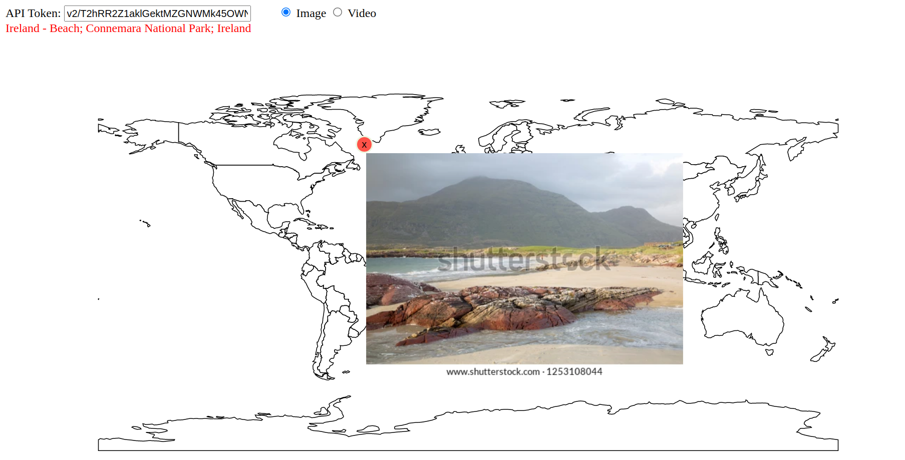

# d3-map-shutterstock
D3.js interactive map integrated with Shutterstock API

You need to provide Shutterstock API token to load the images and the videos.

## Demo
https://rabihaf.github.io/d3-map-shutterstock.html